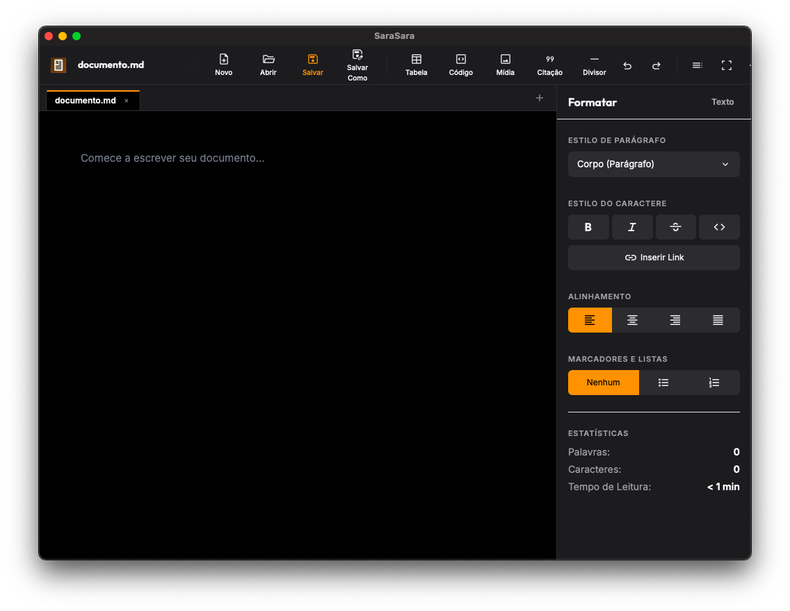

# SaraSara v1.2.0

[Português](#português) | [English](#english) | [日本語](#日本語)

---

## Português

**SaraSara** é um editor de Markdown minimalista e livre de distrações, projetado no Estilo Apple Pages. Seu nome vem da onomatopeia japonesa **"sara-sara" (さらさら)**, que evoca o deslizar fluido, contínuo e sem esforço de uma caneta sobre o papel, representando a escrita que flui de forma natural.

Este aplicativo foi criado para escritores, acadêmicos e programadores que desejam a simplicidade do Markdown combinada com o poder e a elegância de um processador de texto visual moderno.



### 💾 Baixar Versão Desktop (Instaladores Prontos)

As versões compiladas prontas para uso no Windows, macOS e Linux (AppImage) podem ser baixadas diretamente na seção de Releases:  

👉 **[Instaladores Prontos do SaraSara (Releases)](https://github.com/ayanicodemos/SaraSara/releases)**

### 🌐 Versão Web & Demonstração Online

O **SaraSara** possui uma versão 100% Web que roda inteiramente no navegador (com salvamento local via localStorage), dispensando qualquer tipo de instalação. Você pode testar e usar o aplicativo online diretamente em:  

👉 **[https://ayanicodemos.github.io/SaraSara/](https://ayanicodemos.github.io/SaraSara/)**

---

### 🌟 Recursos Principais

### 1. Tela de Escrita Estilo Pages

- Design Premium: Um canvas centralizado que simula uma folha de papel A4 com margens perfeitas, sombras suaves e tipografia moderna (Inter e Outfit).
- Tema Dark Mac-Style: Um modo escuro construído com fundo preto puro (#000000) e painéis cinza-escuro translúcidos (#1c1c1e) inspirados no macOS, com destaques em cor âmbar/laranja.
- Modo Foco (Modo Distração Livre): Oculte instantaneamente todas as barras laterais e menus com um clique para focar exclusivamente na escrita. Pressione Esc para sair a qualquer momento.

### 2. Barra Lateral de Formatação Dinâmica (À Direita)

- Controle de Estilos: Escolha cabeçalhos (H1, H2, H3), parágrafos ou citações em tempo real.
- Alinhamento e Listas: Ajuste o alinhamento do texto (esquerda, centro, direita, justificado) e crie listas numeradas ou com marcadores rapidamente.
- Painéis Contextuais Inteligentes:
- Tabelas: Adicione ou remova linhas e colunas com botões dedicados e ações integradas.
- Imagens: Insira imagens locais ou via URL, com suporte a legendas editáveis e tags ALT, além de upload de arquivos locais.
- Código: Selecione a linguagem de programação desejada no seletor para organizar sua sintaxe e destaque.
- Citações: Insira citações elegantes com campo de texto e autor/origem configuráveis.
- Estatísticas do Documento: Contagem de palavras, caracteres e estimativa de tempo de leitura atualizados em tempo real no rodapé da barra lateral.

### 3. Sumário Estrutural Dinâmico (À Esquerda)

- Uma barra lateral retrátil que gera automaticamente um sumário (Outline) dinâmico baseado nos títulos (H1, H2, H3) do seu documento. Clique em qualquer item para navegar suavemente até o trecho correspondente.

### 4. Sistema Multidocumentos (Abas)

- Trabalhe em vários arquivos ao mesmo tempo com uma elegante barra de abas no estilo macOS.
- Indicadores visuais de alteração (•) para avisar se o documento atual tem modificações pendentes.
- Salvamento automático contínuo na memória interna (localStorage) para evitar qualquer perda de progresso no navegador ou reinicializações.

### 5. Integração com Sistema de Arquivos Local (App Desktop)

- Abrir arquivo (Cmd + O / Ctrl + O): Abra qualquer arquivo .md do seu computador.
- Salvar (Cmd + S / Ctrl + S): Grava as alterações diretamente no arquivo local.
- Salvar Como (Cmd + Shift + S / Ctrl + Shift + S): Crie uma nova cópia do documento no diretório de sua escolha.

### 6. Versão 100% Web Sem Instalação

- O SaraSara também pode ser executado diretamente no navegador. Ele salva e gerencia documentos localmente, permitindo exportar o resultado final fazendo o download do arquivo .md.

---

### 🌐 Idiomas Suportados & Customização (i18n)

O **SaraSara** é totalmente internacionalizável e vem com suporte nativo a 10 idiomas:

- Deutsch (de) - Alemão
- English (en) - Inglês
- Español (es) - Espanhol
- Français (fr) - Francês
- Italiano (it) - Italiano
- Português (pt-BR) - Português (Brasil)
- 日本語 (ja) - Japonês
- 한국어 (ko) - Coreano
- Русский (ru) - Russo
- 简体中文 (zh-CN) - Chinês Simplificado

### 🛠️ Como criar ou personalizar o seu próprio idioma

Você pode adicionar novos idiomas ou personalizar as traduções existentes de forma simples:

1. Crie o arquivo de tradução:
2. Navegue até a pasta src/languages/.
3. Crie um arquivo JSON com o código do seu idioma (por exemplo, it.json ou es.json).
4. Copie a estrutura do arquivo pt-BR.json ou en.json e traduza os valores das chaves para o seu idioma.
5. Adicione o idioma no Menu Dropdown:
6. Abra o arquivo src/index.html.
7. Localize a tag <ul class="dropdown-menu dropdown-menu-end shadow" aria-labelledby="btnLanguageSelector">.
8. Adicione um novo item de lista (<li>) chamando a função switchLanguage com o código do arquivo JSON criado. Por exemplo:

```
     <li><a class="dropdown-item py-2" href="#" onclick="switchLanguage('it'); return false;">Italiano (it)</a></li>
```

- Dica: Ordene a lista colocando os idiomas de alfabeto latino em ordem alfabética primeiro e, depois, os de outros alfabetos no final.
- Traduza os Menus Nativos (Opcional - para a versão desktop Tauri):
- Se você estiver usando a versão desktop nativa, também pode traduzir os itens do menu nativo do sistema operacional (como a barra de menus do macOS).
- Abra o arquivo src-tauri/src/lib.rs.
- Localize a função createmenu e adicione o mapeamento para o seu novo código de idioma nos blocos match lang para aboutlabel, copyright, editlabel e windowlabel.

---

### ⌨️ Atalhos de Teclado Suportados

| Atalho | Ação |
| --- | --- |
| `$2` / `$2` ou `$2` / `$2` | Criar um Novo Documento (Nova Aba)
| `$2` / `$2` | Abrir um Arquivo Local
| `$2` / `$2` | Salvar Alterações no Arquivo Atual
| `$2` / `$2` | Salvar Como (Gravar Novo Arquivo)
| `$2` / `$2` | Fechar Aba Ativa (sem encerrar o app) |

---

### 🚀 Como Executar e Compilar Localmente

### 1. Versão Web

Para rodar a versão web offline localmente, basta abrir o arquivo [src/index.html](src/index.html) diretamente no seu navegador, ou servir a pasta do projeto com um servidor HTTP simples:

```
python3 -m http.server 8000
```

E abrir `$2` no navegador.

### 2. Versão Desktop (Tauri)

Para rodar ou compilar a versão desktop nativa localmente, você precisará ter o **Node.js** e o **Rust (Cargo)** instalados em sua máquina.

- Executar em modo desenvolvimento (Live Reload):

```
  npx @tauri-apps/cli dev
```

- Compilar o instalador nativo para o seu sistema operacional:

```
  npx @tauri-apps/cli build
```

---

## English

**SaraSara** is a minimalist, distraction-free Markdown editor designed in the style of Apple Pages. Its name comes from the Japanese onomatopoeia **"sara-sara" (さらさら)**, which evokes the smooth, continuous, and effortless gliding of a pen over paper, representing writing that flows naturally.

This application was created for writers, academics, and programmers who want the simplicity of Markdown combined with the power and elegance of a modern visual word processor.

### 💾 Download Desktop Version (Ready Installers)

Ready-to-use compiled versions for Windows, macOS, and Linux (AppImage) can be downloaded directly from the Releases section:  

👉 **[Ready Installers of SaraSara (Releases)](https://github.com/ayanicodemos/SaraSara/releases)**

### 🌐 Web Version & Online Demo

**SaraSara** has a 100% Web version that runs entirely in the browser (with local autosave via localStorage), requiring no installation. You can test and use the application online at:  

👉 **[https://ayanicodemos.github.io/SaraSara/](https://ayanicodemos.github.io/SaraSara/)**

---

### 🌟 Key Features

### 1. Pages-Style Writing Canvas

- Premium Design: A centered canvas simulating an A4 sheet of paper with perfect margins, soft shadows, and modern typography (Inter and Outfit).
- Mac-Style Dark Theme: A dark mode built with a pure black background (#000000) and translucent dark gray panels (#1c1c1e) inspired by macOS, highlighted in amber/orange.
- Focus Mode (Distraction-Free): Instantly hide all sidebars and menus with a single click to focus exclusively on your writing. Press Esc to exit at any time.

### 2. Dynamic Formatting Sidebar (Right Side)

- Style Control: Choose headers (H1, H2, H3), paragraphs, or blockquotes in real time.
- Alignment & Lists: Adjust text alignment (left, center, right, justify) and quickly create bulleted or numbered lists.
- Smart Contextual Panels:
- Tables: Add or remove rows and columns using dedicated buttons and inline actions.
- Images: Insert local or URL-based images with support for editable captions, ALT tags, and local file uploads.
- Code: Select your desired programming language in the dropdown selector to structure and syntax highlight your code blocks.
- Quotes: Insert elegant quote blocks with editable quote text and configurable author/source fields.
- Document Statistics: Word count, character count, and estimated reading time are updated in real time at the bottom of the formatting sidebar.

### 3. Dynamic Outline / Table of Contents (Left Side)

- A collapsible sidebar that automatically generates a dynamic table of contents based on the headings (H1, H2, H3) in your document. Click any item to scroll smoothly to that section.

### 4. Multi-document System (Tabs)

- Work on multiple files simultaneously with an elegant macOS-style tab bar.
- Visual change indicators (•) let you know if the active document has unsaved modifications.
- Continuous automatic saving to local storage (localStorage) prevents any loss of progress in the browser or on reload.

### 5. Local File System Integration (Desktop App)

- Open File (Cmd + O / Ctrl + O): Open any .md file from your computer.
- Save (Cmd + S / Ctrl + S): Save changes directly to the local file.
- Save As (Cmd + Shift + S / Ctrl + Shift + S): Create a new copy of the document in a folder of your choice.

### 6. 100% Web Version with Zero Installation

- SaraSara can run directly in your browser. It manages documents locally, allowing you to export your writing by downloading it as a .md file.

---

### 🌐 Supported Languages & Customization (i18n)

**SaraSara** is fully internationalized and comes with native support for 10 languages:

- Deutsch (de) - German
- English (en) - English
- Español (es) - Spanish
- Français (fr) - French
- Italiano (it) - Italian
- Português (pt-BR) - Portuguese (Brazil)
- 日本語 (ja) - Japanese
- 한국어 (ko) - Korean
- Русский (ru) - Russian
- 简体中文 (zh-CN) - Simplified Chinese

### 🛠️ How to create or customize your own language

You can easily add new languages or customize existing translations:

1. Create the translation file:
2. Navigate to the src/languages/ folder.
3. Create a JSON file named after your language code (e.g., it.json or es.json).
4. Copy the structure of pt-BR.json or en.json and translate the values of the keys into your language.
5. Add the language to the Dropdown Menu:
6. Open src/index.html.
7. Locate the <ul class="dropdown-menu dropdown-menu-end shadow" aria-labelledby="btnLanguageSelector"> tag.
8. Add a new list item (<li>) invoking the switchLanguage function with your language code. For example:

```
     <li><a class="dropdown-item py-2" href="#" onclick="switchLanguage('it'); return false;">Italiano (it)</a></li>
```

- Tip: Keep the list ordered with Latin-alphabet languages alphabetically first, and other alphabets at the end.
- Translate Native Menus (Optional - for the Tauri desktop version):
- If you are running the native desktop version, you can translate the operating system menu bar (such as the macOS top menu bar).
- Open src-tauri/src/lib.rs.
- Locate the createmenu function and map your new language code in the match lang branches for aboutlabel, copyright, editlabel, and windowlabel.

---

### ⌨️ Supported Keyboard Shortcuts

| Shortcut | Action |
| --- | --- |
| `$2` / `$2` or `$2` / `$2` | Create a New Document (New Tab)
| `$2` / `$2` | Open a Local File
| `$2` / `$2` | Save Changes to Active File
| `$2` / `$2` | Save As (Write to a New File)
| `$2` / `$2` | Close Active Tab (without quitting app) |

---

### 🚀 How to Run and Compile Locally

### 1. Web Version

To run the web version locally offline, open [src/index.html](src/index.html) directly in your browser, or serve the project folder using a simple HTTP server:

```
python3 -m http.server 8000
```

Then open `$2` in your browser.

### 2. Desktop Version (Tauri)

To run or build the native desktop application locally, you must have **Node.js** and **Rust (Cargo)** installed on your machine.

- Run in development mode (Live Reload):

```
  npx @tauri-apps/cli dev
```

- Compile the native installer for your operating system:

```
  npx @tauri-apps/cli build
```

---

## 日本語

**SaraSara (サラサラ)** は、Apple Pages風にデザインされた、ミニマリストで気を散らさないMarkdownエディタです。

このアプリケーションは、Markdownのシンプルさと、モダンでビジュアルなワードプロセッサのパワーおよびエレガンスを兼ね備えた環境を求める、ライター、研究者、プログラマーのために作成されました。

### 💾 デスクトップ版のダウンロード (コンパイル済みインストーラー)

Windows、macOS、Linux (AppImage) 用のコンパイル済みインストーラーは、Releasesセクションから直接ダウンロードできます。  

👉 **[SaraSara プリコンパイル済みインストーラー (Releases)](https://github.com/ayanicodemos/SaraSara/releases)**

### 🌐 Web版 & オンラインデモ

**SaraSara** には、ブラウザだけで動作する100% Web版（localStorageによるローカル自動保存対応）があり、インストール不要で利用できます。以下のURLから直接テストおよび利用が可能です。  

👉 **[https://ayanicodemos.github.io/SaraSara/](https://ayanicodemos.github.io/SaraSara/)**

---

### 🌟 主な機能

### 1. Pagesスタイルの執筆キャンバス

- プレミアムデザイン: 完璧な余白、ソフトなシャドウ、モダンなタイポグラフィ（InterおよびOutfitフォント）を備え、A4用紙をシミュレートした中央寄せキャンバス。
- Macスタイルのダークテーマ: macOSにインスパイアされた、純粋な黒背景（#000000）と半透明のダークグレーパネル（#1c1c1e）で構築され、アンバー/オレンジで強調されたダークモード。
- フォーカスモード (気を散らさないモード): ワンクリックでサイドバーとメニューを即座に非表示にし、執筆だけに集中できます。Esc キーを押すことでいつでも終了できます。

### 2. 動的フォーマットサイドバー (右側)

- スタイルコントロール: 見出し（H1, H2, H3）、段落、引用（ブロッククオート）をリアルタイムで選択可能。
- 配置とリスト: テキストの配置（左寄せ、中央寄せ、右寄せ、両端揃え）を調整し、箇条書きリストや番号付きリストを素早く作成可能。
- スマートなコンテキストパネル:
- テーブル (表): 専用ボタンとインライン操作を使用して、行や列を自由に追加・削除。
- 画像: ローカルアップロードまたはURL経由で画像を挿入し、編集可能なキャプションとALTタグをサポート。
- コード: ドロップダウンからプログラミング言語を選択して、コードブロックを美しく構造化し、シンタックスハイライトを適用。
- 引用: 引用文と著者名/出典を設定できる、エレガントな引用ブロック。
- ドキュメント統計: 単語数、文字数、推定読書時間をフォーマットサイドバー下部にリアルタイムで表示。

### 3. 動的目次 / アウトライン (左側)

- ドキュメント内の見出し（H1, H2, H3）に基づいて自動的に動的な目次（アウトライン）を生成する折りたたみ式サイドバー。任意の項目をクリックすると、該当するセクションまでスムーズにスクロールします。

### 4. マルチドキュメントシステム (タブ)

- macOSスタイルのエレガントなタブバーを使用して、複数のファイルを同時に並行作業。
- ドキュメントに変更がある場合、タブに視覚的なインジケータ（•）が表示されます。
- ローカルストレージ（localStorage）への自動保存により、ブラウザの更新時にも進捗を失うことはありません。

### 5. ローカルファイルシステム連携 (デスクトップ版)

- ファイルを開く (Cmd + O / Ctrl + O): コンピュータ上の任意の .md ファイルを開きます。
- 保存 (Cmd + S / Ctrl + S): 変更内容をローカルファイルに直接保存します。
- 名前を付けて保存 (Cmd + Shift + S / Ctrl + Shift + S): 任意のディレクトリにドキュメントの新しいコピーを作成します。

### 6. インストール不要の 100% Web版

- SaraSara はブラウザで直接動作します。ドキュメントをローカルで管理し、書いた文章を .md ファイルとしてダウンロードしてエクスポートできます。

---

### 🌐 サポート言語とカスタマイズ (i18n)

**SaraSara** は完全な多言語対応（i18n）を実装しており、ネイティブで10言語に対応しています。

- Deutsch (de) - ドイツ語
- English (en) - 英語
- Español (es) - スペイン語
- Français (fr) - フランス語
- Italiano (it) - イタリア語
- Português (pt-BR) - ポルトガル語（ブラジル）
- 日本語 (ja) - 日本語
- 한국어 (ko) - 韓国語
- Русский (ru) - ロシア語
- 简体中文 (zh-CN) - 簡体字中国語

### 🛠️ 自作の言語ファイルを追加・カスタマイズする方法

新しい言語を追加したり、既存の翻訳を調整したりするのは非常に簡単です。

1. 翻訳ファイルの作成:
2. src/languages/ フォルダへ移動します。
3. 独自の言語コード（例: it.json や es.json）のJSONファイルを作成します。
4. pt-BR.json または en.json の構造をコピーし、各キーの値を翻訳します。
5. ドロップダウンメニューへの追加:
6. src/index.html ファイルを開きます。
7. <ul class="dropdown-menu dropdown-menu-end shadow" aria-labelledby="btnLanguageSelector"> タグを見つけます。
8. 作成した言語コードを引数に指定して switchLanguage 関数を呼び出す <li> リスト項目を追加します。例:

```
     <li><a class="dropdown-item py-2" href="#" onclick="switchLanguage('it'); return false;">Italiano (it)</a></li>
```

- ヒント: リストは、ラテン文字（アルファベット）の言語を最初にアルファベット順で並べ、その後にラテン文字以外の言語（日本語、中国語など）を最後に配置してください。
- OS標準メニューの翻訳 (オプション - Tauriデスクトップ版用):
- デスクトップ版のOS標準メニュー（macOSの上部メニューバーなど）のラベルも翻訳できます。
- src-tauri/src/lib.rs を開きます。
- createmenu 関数を見つけ、match lang ブロックの aboutlabel、copyright、editlabel、windowlabel に新しい言語用の分岐を追加します。

---

### ⌨️ サポートされているキーボードショートカット

| ショートカット | アクション |
| --- | --- |
| `$2` / `$2` または `$2` / `$2` | 新規ドキュメント作成 (新しいタブ)
| `$2` / `$2` | ローカルファイルを開く
| `$2` / `$2` | 当前的ファイルへの変更を保存
| `$2` / `$2` | 名前を付けて保存 (新しいファイルに書き込み)
| `$2` / `$2` | 当前のタブを閉じる (アプリは終了しない) |

---

### 🚀 ローカルでの実行とビルド方法

### 1. Web版

Web版をローカルでオフライン実行するには、[src/index.html](src/index.html) をブラウザで直接開くか、シンプルなHTTPサーバーを使用してプロジェクトフォルダを提供します。

```
python3 -m http.server 8000
```

その後、ブラウザで `$2` を開きます。

### 2. デスクトップ版 (Tauri)

デスクトップ版をローカルで実行またはビルドするには、マシンに **Node.js** と **Rust (Cargo)** がインストールされている必要があります。

- 開発モードでの実行 (ライブリロード):

```
  npx @tauri-apps/cli dev
```

- OS用のネイティブインストーラーのコンパイル:

```
  npx @tauri-apps/cli build
```

---

*Desenvolvido por Aya Nicodemos — Ayasoft Studios 2026.*  

*Website:* [https://ayasoft.com.br/sarasara](https://ayasoft.com.br/sarasara)